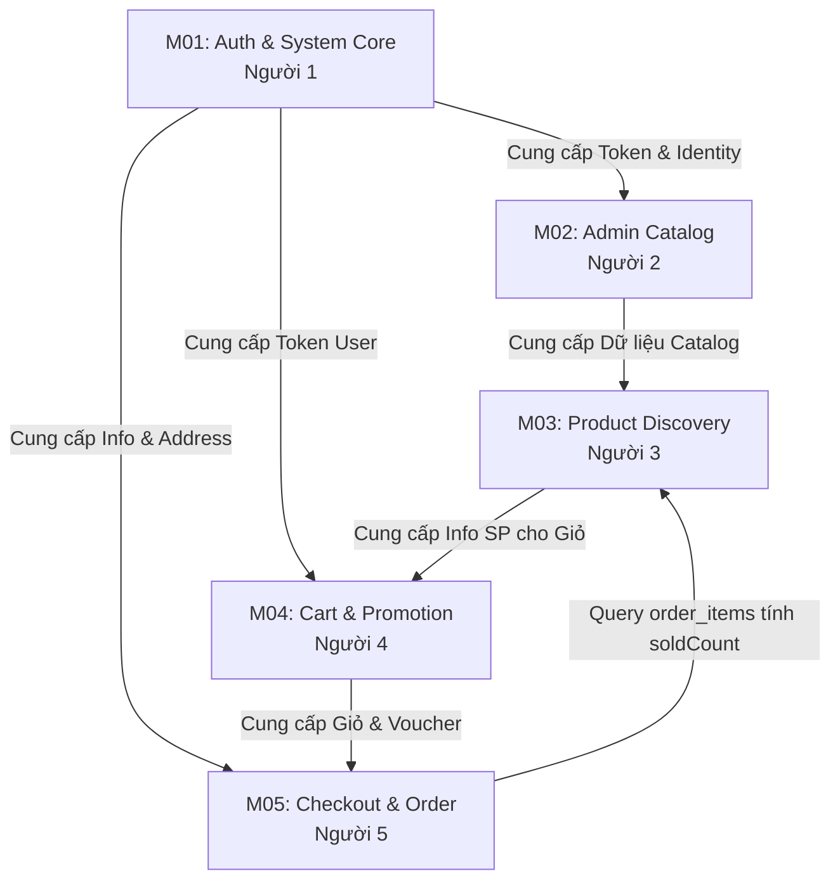

# 📋 KẾ HOẠCH AUDIT VÀ PHÂN CÔNG CÔNG VIỆC - DỰ ÁN UTE FASHION HUB

> **Tech Lead Assessment & Task Allocation Plan**  
> **Dự án**: UTE Fashion Hub (Thương mại điện tử thời trang)  
> **Quy mô nhóm**: 5 thành viên  
> **Trạng thái**: Đã hoàn thiện toàn bộ (Phần A, Phần B & Phần C)  

---

## 🔍 PHẦN A: AUDIT TOÀN BỘ DỰ ÁN

### 1. Project Overview (Tổng quan Công nghệ & Cấu trúc)
* **Frontend**: Next.js 16.0.7 (App Router), React 19, TypeScript 5, Tailwind CSS 4, Zustand (State Management), Axios & SWR (Data Fetching), Lucide React Icons.
* **Backend**: Java 17, Spring Boot 3.5.8, Spring Security 6 (Stateless JWT + Google OAuth2), Spring Data JPA (Hibernate), Maven Wrapper (`./mvnw`).
* **Database & Cache**: PostgreSQL 15/16 (Relational Database) + Redis 7 (Caching, Session, Cart storage).
* **Cấu trúc thư mục chính**:
  * Root: `backend/`, `frontend/`, `docs/`, `PHAN_CONG.md`
  * `backend/`: `src/main/java/com/utephonehub/backend/` (`config`, `controller`, `dto`, `entity`, `enums`, `exception`, `repository`, `security`, `service`), `src/main/resources/` (`application.yml`, `db/migration`), `migrations/`, `Dockerfile`, `docker-compose.yml`.
  * `frontend/`: `app/` (`(admin)`, `(auth)`, `(main)`, `admin-panel`, `auth`, `globals.css`, `layout.tsx`), `components/` (`common`, `dashboard`, `features`, `ui`), `services/`, `store/`, `types/`, `hooks/`, `lib/` (`api.ts`, `utils.ts`, `auth-context.tsx`).

---

### 2. Module Inventory (Danh mục Chức năng Thực tế trong Code)

#### 🔹 M01: Xác thực & Quản lý Tài khoản (Auth & User Profile)
* **Chức năng**: Đăng nhập truyền thống, Đăng ký, Quên mật khẩu OTP, Đăng nhập Google OAuth2, Quản lý Hồ sơ cá nhân, Sổ địa chỉ hành chính 3 cấp (Tỉnh/Thành, Quận/Huyện, Phường/Xã).
* **Frontend Files**: `frontend/app/(auth)/login/page.tsx`, `frontend/components/features/auth/RegisterForm.tsx`, `frontend/components/features/dashboard/CustomerProfile.tsx`, `frontend/components/features/dashboard/CustomerAddresses.tsx`, `frontend/services/address.service.ts`.
* **Backend Files**: `backend/src/main/java/com/utephonehub/backend/controller/AuthController.java`, `UserController.java`, `AddressController.java`, `SecurityConfig.java`.
* **API Endpoints**: `/api/v1/auth/login`, `/api/v1/auth/register`, `/api/v1/auth/forgot-password`, `/api/v1/users/me`, `/api/v1/addresses/**`, `/api/v1/locations/**`.
* **Database Tables**: `users`, `addresses`, `provinces`, `districts`, `wards`.
* **Validation & Business Logic**: BCrypt password hashing, Stateless JWT Tokens (Access/Refresh), OAuth2 Google Client Redirect, Quản lý địa chỉ mặc định (`isDefault`).
* **Phụ thuộc**: Phân hệ lõi (Không phụ thuộc module khác).

#### 🔹 M02: Quản lý Catalog Admin (Product, Category, Brand Admin)
* **Chức năng**: CRUD Sản phẩm, Quản lý kho hàng (Stock), Tải ảnh sản phẩm, Xóa mềm (Soft Delete), Cấu hình thuộc tính JSON Metadata, Quản lý Danh mục (Category) & Thương hiệu (Brand).
* **Frontend Files**: `frontend/app/admin-panel/products/page.tsx`, `frontend/components/features/admin/ProductManagement.tsx`, `frontend/components/features/admin/ProductForm.tsx`, `frontend/components/features/dashboard/CategoryManagement.tsx`, `frontend/components/features/dashboard/BrandManagement.tsx`, `frontend/services/product.service.ts`.
* **Backend Files**: `backend/src/main/java/com/utephonehub/backend/controller/ProductController.java`, `AdminCategoryController.java`, `AdminBrandController.java`, `ProductServiceImpl.java`.
* **API Endpoints**: `/api/v1/products` (POST/PUT/DELETE/PATCH), `/api/v1/admin/categories/**`, `/api/v1/admin/brands/**`.
* **Database Tables**: `products`, `product_images`, `product_templates`, `product_metadata`, `categories`, `brands`.
* **Validation & Business Logic**: Ràng buộc phân quyền `ROLE_ADMIN`, Upload ảnh qua multipart, Kiểm tra trùng mã SKU/Slug, Soft delete flag `is_deleted`.
* **Phụ thuộc**: M01 (Yêu cầu Token xác thực Admin).

#### 🔹 M03: Khám phá & So sánh Sản phẩm Client (Product Discovery & Comparison)
* **Chức năng**: Trang chủ (Banner, Sản phẩm bán chạy, Flash sale, Mới về), Bộ lọc tìm kiếm đa chiều (Giá, Chất liệu, Phong cách, Kích thước), Trang chi tiết sản phẩm, So sánh 2-4 sản phẩm cùng lúc.
* **Frontend Files**: `frontend/app/(main)/page.tsx`, `frontend/app/(main)/products/page.tsx`, `frontend/components/features/products/ProductViewPage.tsx`, `frontend/components/features/products/ComparisonTable.tsx`, `frontend/services/product-view.service.ts`.
* **Backend Files**: `backend/src/main/java/com/utephonehub/backend/controller/ProductViewController.java`, `backend/src/main/java/com/utephonehub/backend/service/impl/ProductViewServiceImpl.java`.
* **API Endpoints**: `/api/v1/products/public/**`, `/api/v1/products/filter`, `/api/v1/products/compare`, `/api/v1/products/{id}/detail`.
* **Database Tables**: `products`, `product_images`, `product_templates`, `product_metadata`, `categories`, `brands`, `reviews`.
* **Validation & Business Logic**: Lọc linh hoạt theo JSON Attribute, Tính điểm so sánh tương đồng, Render dữ liệu phía Client mượt mà.
* **Phụ thuộc**: M02 (Đọc dữ liệu từ Catalog Sản phẩm).

#### 🔹 M04: Giỏ hàng & Động cơ Khuyến mãi (Cart & Promotion Engine)
* **Chức năng**: Giỏ hàng lưu trữ Redis (khách vãng lai & thành viên), Đồng bộ giỏ hàng khi đăng nhập, Áp dụng Voucher (giảm % hoặc tiền cố định), Kiểm tra điều kiện đơn hàng tối thiểu & lượt dùng Voucher.
* **Frontend Files**: `frontend/app/(main)/cart/page.tsx`, `frontend/components/features/cart/CartItem.tsx`, `frontend/components/features/cart/CartSummary.tsx`, `frontend/components/features/promotion/PromotionList.tsx`, `frontend/store/cartStore.ts`.
* **Backend Files**: `backend/src/main/java/com/utephonehub/backend/controller/CartController.java`, `GuestCartController.java`, `PromotionController.java`, `RedisCartServiceImpl.java`, `PromotionServiceImpl.java`.
* **API Endpoints**: `/api/v1/cart/**`, `/api/v1/guest-cart/**`, `/api/v1/promotions/**`, `/api/v1/promotions/calculate-discount`.
* **Database Tables**: `carts`, `cart_items`, `promotions`, `promotion_targets`, `promotion_templates`, Bộ nhớ Redis Key-Value.
* **Validation & Business Logic**: Tính toán giảm giá tự động, kiểm tra hạn dùng voucher, tự động xóa sản phẩm quá hạn khỏi Redis cart.
* **Phụ thuộc**: M01 (Khách hàng đăng nhập), M03 (Sản phẩm thêm vào giỏ).

#### 🔹 M05: Đặt hàng, Thanh toán VNPay & Admin Dashboard (Checkout, Order & Dashboard)
* **Chức năng**: Đặt hàng (COD & VNPay), Tích hợp VNPay Checkout & IPN Callback, Tra cứu đơn hàng bằng Mã QR không cần login, Quản lý vòng đời đơn hàng Admin, Thống kê Doanh thu & Biểu đồ Dashboard.
* **Frontend Files**: `frontend/app/(main)/checkout/page.tsx`, `frontend/components/features/payment/PaymentReturnClient.tsx`, `frontend/components/features/dashboard/AdminDashboard.tsx`, `RevenueChart.tsx`, `frontend/hooks/useOrders.ts`.
* **Backend Files**: `backend/src/main/java/com/utephonehub/backend/controller/OrderController.java`, `PublicOrderController.java`, `AdminOrderController.java`, `PaymentController.java`, `DashboardController.java`, `OrderServiceImpl.java`.
* **API Endpoints**: `/api/v1/orders`, `/api/v1/public/orders/{orderCode}`, `/api/v1/admin/orders/**`, `/api/v1/payments/vnpay/create`, `/api/v1/payments/vnpay/callback`, `/api/v1/admin/dashboard/**`.
* **Database Tables**: `orders`, `order_items`, `order_status_history`, `payments`, `payment_callback_logs`.
* **Validation & Business Logic**: Kiểm tra Secure Hash VNPay checksum, Trừ tồn kho khi tạo đơn hàng thành công, Chuyển trạng thái đơn hàng (PENDING -> DELIVERED), Thống kê dữ liệu báo cáo real-time.
* **Phụ thuộc**: M01 (Khách hàng & Địa chỉ giao), M04 (Giỏ hàng & Giá trị đơn hàng sau giảm giá).

---

### 3. Bug / Risk Inventory (Danh mục Lỗi & Rủi ro Dựa trên Code Thật)

#### 🔴 Bug chắc chắn tồn tại (Definite Bugs)
1. **[ProductViewServiceImpl.java: L371, L1043, L1047]**: Lỗi `soldCount` trả về 0 / dữ liệu giả trong API sản phẩm bán chạy.  
   *File*: `backend/src/main/java/com/utephonehub/backend/service/impl/ProductViewServiceImpl.java` (dòng 371, 1043, 1047)  
   *Mô tả*: Code đang ghi `// TODO: Khi có OrderItemRepository, implement actual sold count query`, chưa query bảng `order_items` nên lượt bán của sản phẩm luôn bằng 0.
2. **[OrderServiceImpl.java: L180, L195]**: Thiếu Validation Voucher còn hiệu lực khi Đặt hàng.  
   *File*: `backend/src/main/java/com/utephonehub/backend/service/impl/OrderServiceImpl.java` (dòng 180, 195)  
   *Mô tả*: Đoạn code đặt hàng chứa `// TODO: Validate promotion còn hiệu lực, đủ điều kiện áp dụng`, dẫn tới việc voucher hết hạn vẫn áp dụng được giảm giá.
3. **[OrderServiceImpl.java: L621]**: Không hoàn trả số lượng kho khi Hủy đơn hàng.  
   *File*: `backend/src/main/java/com/utephonehub/backend/service/impl/OrderServiceImpl.java` (dòng 621)  
   *Mô tả*: Chứa `// TODO: Restore stock at ProductTemplate level if needed`, khi hủy đơn hàng tồn kho không được cộng trả lại trong `product_templates`.
4. **[CartEventListener.java: L22, L41]**: Đồng bộ WebSocket giỏ hàng chưa cài đặt.  
   *File*: `backend/src/main/java/com/utephonehub/backend/listener/CartEventListener.java` (dòng 22, 41)  
   *Mô tả*: Sự kiện lắng nghe giỏ hàng chỉ là stub trống với comment `// TODO`, gây lệch dữ liệu giỏ hàng giữa các tab trình duyệt.

#### 🟠 Chức năng chưa hoàn thiện (Unfinished Features)
1. **[AdminOrderServiceImpl.java: L140]**: Thiếu lưu ghi chú của Admin vào lịch sử trạng thái đơn hàng (`backend/src/main/java/com/utephonehub/backend/service/impl/AdminOrderServiceImpl.java:140`).
2. **[api.ts: L389]**: Public API Sản phẩm Frontend đang fallback dùng `mockData.ts` (`frontend/lib/api.ts:389`).
3. **[ProductsTable.tsx: L11 & UsersTable.tsx: L10]**: Bảng Dashboard Admin cũ đang hiển thị dữ liệu giả từ `mockData.ts` (`frontend/components/features/dashboard/ProductsTable.tsx:11`).

#### 🟡 Chức năng chưa được test (Un-tested Features)
1. Quy trình VNPay Callback / IPN Sandbox (`VNPayServiceImpl.java:50`).
2. Google OAuth2 Authentication Flow với Google App Client ID thực tế (`CustomOidcUserService.java:30`).
3. Tìm kiếm & Phân trang Admin Users (`AdminUserController.java:35`).

#### ⚡ Code có nguy cơ gây lỗi & Rủi ro Bảo mật (Code Risks)
1. **[SecurityConfig.java: L162-L163]**: Mở công khai `permitAll()` cho API Admin Promotion (`backend/src/main/java/com/utephonehub/backend/config/SecurityConfig.java:162`).  
   *Rủi ro*: Bất kỳ người dùng nào cũng có thể gọi API tạo/sửa/xóa Voucher Admin mà không cần đăng nhập Admin.
2. **[api.ts: L71-L93]**: Lưu trữ Token xác thực ở `localStorage` (`frontend/lib/api.ts:71`).  
   *Rủi ro*: Dễ bị đánh cắp Token nếu gặp các cuộc tấn công XSS.

---

### 4. File Dùng Chung (Shared Files Inventory)
Các file dưới đây là **file dùng chung**, điểm cực kỳ dễ gây xung đột (conflict) khi làm việc nhóm:
1. `frontend/lib/api.ts` (Axios / Fetch Config, Base URL, Auth Token Interceptor, TypeScript Request/Response Schemas).
2. `frontend/app/layout.tsx` & `frontend/app/globals.css` (Root Layout HTML, Typography, Tailwind CSS 4 setup).
3. `frontend/app/(main)/layout.tsx` (Main Layout, Wrapper Header/Footer).
4. `frontend/components/features/layout/MainHeader.tsx`, `Sidebar.tsx`, `Footer.tsx` (Header / Navbar / Footer chung).
5. `frontend/lib/auth-context.tsx` & `frontend/hooks/useAuth.ts` (State xác thực toàn ứng dụng).
6. `backend/src/main/java/com/utephonehub/backend/config/SecurityConfig.java` (Spring Security Chain & Phân quyền URL).
7. `backend/src/main/java/com/utephonehub/backend/security/JwtTokenProvider.java` & `JwtAuthenticationFilter.java` (Xử lý JWT).
8. `backend/src/main/resources/application.yml` & `docker-compose.yml` (Cấu hình môi trường & Kết nối DB/Redis).
9. `backend/migrations/` & `backend/init.sql` (Cấu trúc Bảng & Dữ liệu Seed SQL).
10. `package.json`, `frontend/package.json`, `backend/pom.xml` (Khai báo Thư viện phụ thuộc).

---

## 👥 PHẦN B: KẾ HOẠCH CHIA VIỆC VÀ PHÂN QUYỀN FILE

### 5. Nguyên tắc chia 5 Module Business
Dự án được chia theo **Business Module** độc lập, không chia theo tầng FE/BE.

* **Người 1 (Owner 1) - Leader / Auth & Core Infrastructure**: Module M01 (Xác thực, Profile, Địa chỉ) + Quản lý File Dùng Chung & Security.
* **Người 2 (Owner 2) - Admin Catalog Manager**: Module M02 (Quản lý Sản phẩm, Danh mục, Thương hiệu Admin).
* **Người 3 (Owner 3) - Product Discovery & Experience**: Module M03 (Trang chủ, Xem & Lọc sản phẩm, Chi tiết, So sánh sản phẩm Client).
* **Người 4 (Owner 4) - Cart & Promotion Engine**: Module M04 (Giỏ hàng Redis & Local Sync, Động cơ Voucher Khuyến mãi).
* **Người 5 (Owner 5) - Checkout, Payment & Admin Dashboard**: Module M05 (Đặt hàng, VNPay, Tra cứu mã QR, Admin Order & Sales Dashboard).

---

### 6 & 7. Quy tắc Quyền Sửa File (File Ownership)
* **Quy tắc tuyệt đối**: Mỗi file chỉ thuộc về **ĐÚNG 1 OWNER**.
* **File dùng chung**: Được chỉ định duy nhất cho **Người 1**. Các thành viên khác nếu cần sửa file dùng chung thì ghi yêu cầu vào danh sách **"Yêu cầu sửa file chung"** để Người 1 thực hiện, tuyệt đối không tự sửa.

#### 📋 Danh sách "Yêu cầu sửa file dùng chung" (Cần làm ngay từ đầu):
1. **Yêu cầu 1 (Từ Người 4 ➔ Người 1)**: Thêm helper function `calculateDiscount` vào `frontend/lib/api.ts`.
2. **Yêu cầu 2 (Từ Người 4 ➔ Người 1)**: Đóng bảo mật API Voucher Admin trong `SecurityConfig.java` (Sửa dòng 162 `.permitAll()` thành `.hasRole("ADMIN")`).
3. **Yêu cầu 3 (Từ Người 5 ➔ Người 1)**: Thêm route `/api/v1/payments/vnpay/callback` permitAll công khai cho VNPay IPN trong `SecurityConfig.java`.

---

### 8. Cân Bằng Khối Lượng Công Việc (Workload Balance)

* **Người 1 (Auth & Core Infrastructure)**: **20%**  
  *Khối lượng*: 15 files (Auth + Toàn bộ Core Shared Files). Độ khó cao về bảo mật JWT, OAuth2, SecurityConfig.
* **Người 2 (Admin Catalog)**: **20%**  
  *Khối lượng*: 18 files. Độ khó cao về CRUD sản phẩm kèm thuộc tính JSON Metadata, upload nhiều ảnh và quản lý kho.
* **Người 3 (Product Discovery & Compare)**: **20%**  
  *Khối lượng*: 22 files. Độ khó trung bình về UI/UX, lọc đa chiều, so sánh 4 sản phẩm cùng lúc, chịu trách nhiệm sửa bug `soldCount`.
* **Người 4 (Cart & Promotion Engine)**: **20%**  
  *Khối lượng*: 17 files. Độ khó cao về lưu trữ Redis Cart, đồng bộ giỏ hàng, tính toán logic giảm giá Voucher & sửa bug validation voucher.
* **Người 5 (Checkout, Payment & Dashboard)**: **20%**  
  *Khối lượng*: 21 files. Độ khó cao về quy trình đặt hàng, tích hợp thanh toán VNPay IPN checksum, biểu đồ thống kê real-time & sửa bug hoàn kho khi hủy đơn.

---

### 9. Bảng Tổng Quan Phân Công (Overview Table)

| Người | Module | Chức năng chính | FE Files | BE Files | DB Tables | Workload |
| :--- | :--- | :--- | :--- | :--- | :--- | :---: |
| **Người 1** | **M01 + Core Shared** | Đăng nhập/Đăng ký, Profile, Địa chỉ, JWT, OAuth2, Core Configs & Layouts | `app/(auth)/*`, `CustomerProfile.tsx`, `CustomerAddresses.tsx`, `api.ts`, `layout.tsx` | `AuthController.java`, `UserController.java`, `AddressController.java`, `SecurityConfig.java`, `JwtTokenProvider.java` | `users`, `addresses`, `provinces`, `wards` | **20%** |
| **Người 2** | **M02 - Admin Catalog** | Quản lý Sản phẩm, Danh mục, Thương hiệu (CRUD, Upload ảnh, Stock, Soft Delete) | `app/admin-panel/*`, `ProductManagement.tsx`, `ProductForm.tsx`, `CategoryManagement.tsx`, `BrandManagement.tsx` | `ProductController.java` (Admin methods), `AdminCategoryController.java`, `AdminBrandController.java`, `ProductServiceImpl.java` | `products`, `product_images`, `product_templates`, `product_metadata`, `categories`, `brands` | **20%** |
| **Người 3** | **M03 - Product Discovery** | Trang chủ, Xem sản phẩm, Lọc đa chiều, Search, Trang chi tiết, So sánh sản phẩm | `app/(main)/page.tsx`, `app/(main)/products/*`, `ProductViewPage.tsx`, `ComparisonTable.tsx`, `ProductCard.tsx` | `ProductViewController.java`, `ProductViewServiceImpl.java`, `ProductRepository.java` | `products`, `categories`, `brands`, `reviews` | **20%** |
| **Người 4** | **M04 - Cart & Voucher** | Giỏ hàng (Redis & Local Sync), Voucher/Khuyến mãi, Tính tiền giảm giá | `app/(main)/cart/*`, `app/(main)/promotions/*`, `CartItem.tsx`, `CartSummary.tsx`, `PromotionList.tsx` | `CartController.java`, `GuestCartController.java`, `PromotionController.java`, `RedisCartServiceImpl.java`, `PromotionServiceImpl.java` | `carts`, `cart_items`, `promotions`, `promotion_targets`, `promotion_templates` | **20%** |
| **Người 5** | **M05 - Order & Payment** | Đặt hàng, Thanh toán VNPay, Tra cứu đơn hàng QR, Admin Order & Dashboard | `app/(main)/checkout/*`, `app/(main)/orders/*`, `app/(main)/payment/*`, `app/(admin)/admin/*`, `AdminDashboard.tsx` | `OrderController.java`, `PublicOrderController.java`, `AdminOrderController.java`, `PaymentController.java`, `DashboardController.java` | `orders`, `order_items`, `order_status_history`, `payments`, `payment_callback_logs` | **20%** |

---

### 10. Bảng File Ownership & Phân Quyền Sửa File

| Đường dẫn File / Thư mục | Chủ sở hữu (Owner) | Thành viên khác có được sửa không? |
| :--- | :---: | :---: |
| `frontend/lib/api.ts` | **Người 1** | ❌ KHÔNG (Gửi yêu cầu cho Người 1) |
| `frontend/app/layout.tsx` & `globals.css` | **Người 1** | ❌ KHÔNG (Gửi yêu cầu cho Người 1) |
| `frontend/components/features/layout/*` | **Người 1** | ❌ KHÔNG |
| `backend/.../config/SecurityConfig.java` | **Người 1** | ❌ KHÔNG (Gửi yêu cầu cho Người 1) |
| `backend/.../security/*` | **Người 1** | ❌ KHÔNG |
| `backend/src/main/resources/application.yml` | **Người 1** | ❌ KHÔNG |
| `backend/docker-compose.yml` | **Người 1** | ❌ KHÔNG |
| `frontend/app/(auth)/*` | **Người 1** | ❌ KHÔNG |
| `frontend/services/address.service.ts` | **Người 1** | ❌ KHÔNG |
| `frontend/app/admin-panel/*` | **Người 2** | ❌ KHÔNG |
| `frontend/components/features/admin/*` | **Người 2** | ❌ KHÔNG |
| `frontend/services/product.service.ts` | **Người 2** | ❌ KHÔNG |
| `frontend/services/brand.service.ts` | **Người 2** | ❌ KHÔNG |
| `frontend/services/category.service.ts` | **Người 2** | ❌ KHÔNG |
| `backend/.../controller/AdminCategoryController.java` | **Người 2** | ❌ KHÔNG |
| `backend/.../controller/AdminBrandController.java` | **Người 2** | ❌ KHÔNG |
| `frontend/app/(main)/page.tsx` & `products/*` | **Người 3** | ❌ KHÔNG |
| `frontend/components/features/products/*` | **Người 3** | ❌ KHÔNG |
| `frontend/services/product-view.service.ts` | **Người 3** | ❌ KHÔNG |
| `backend/.../controller/ProductViewController.java` | **Người 3** | ❌ KHÔNG |
| `backend/.../service/impl/ProductViewServiceImpl.java` | **Người 3** | ❌ KHÔNG |
| `frontend/app/(main)/cart/*` & `promotions/*` | **Người 4** | ❌ KHÔNG |
| `frontend/components/features/cart/*` & `promotion/*` | **Người 4** | ❌ KHÔNG |
| `frontend/store/cartStore.ts` | **Người 4** | ❌ KHÔNG |
| `backend/.../controller/CartController.java` | **Người 4** | ❌ KHÔNG |
| `backend/.../controller/PromotionController.java` | **Người 4** | ❌ KHÔNG |
| `backend/.../service/impl/PromotionServiceImpl.java` | **Người 4** | ❌ KHÔNG |
| `frontend/app/(main)/checkout/*`, `orders/*`, `payment/*` | **Người 5** | ❌ KHÔNG |
| `frontend/app/(admin)/admin/*` | **Người 5** | ❌ KHÔNG |
| `frontend/components/features/checkout/*`, `payment/*`, `dashboard/*` | **Người 5** | ❌ KHÔNG |
| `backend/.../controller/OrderController.java` & `AdminOrderController.java` | **Người 5** | ❌ KHÔNG |
| `backend/.../controller/PaymentController.java` & `DashboardController.java` | **Người 5** | ❌ KHÔNG |
| `backend/.../service/impl/OrderServiceImpl.java` & `PaymentServiceImpl.java` | **Người 5** | ❌ KHÔNG |

---

### 11. Phân Phạm Vi Chi Tiết Cho Từng Người

#### 👤 Người 1 (Auth & System Core)
* **Phạm vi**: Toàn bộ hệ thống xác thực người dùng (Auth), thông tin tài khoản, sổ địa chỉ, phân quyền Security, JWT, OAuth2 Google và hạ tầng file dùng chung.
* **File ĐƯỢC SỬA**:
  * `frontend/app/(auth)/*`, `frontend/app/auth/*`
  * `frontend/components/features/auth/*`
  * `frontend/components/features/dashboard/CustomerProfile.tsx`, `CustomerAddresses.tsx`, `AddressDialog.tsx`
  * `frontend/services/address.service.ts`, `frontend/hooks/useAuth.ts`, `useAddress.ts`, `frontend/lib/auth-context.tsx`
  * Tất cả các file DÙNG CHUNG: `frontend/lib/api.ts`, `frontend/app/layout.tsx`, `globals.css`, `MainHeader.tsx`, `Sidebar.tsx`, `Footer.tsx`
  * `backend/.../config/SecurityConfig.java`, `CorsConfig.java`, `backend/.../security/*`
  * `backend/.../controller/AuthController.java`, `UserController.java`, `AddressController.java`, `LocationController.java`
* **File KHÔNG ĐƯỢC ĐỤNG**: Tất cả các file thuộc M02, M03, M04, M05.
* **Module phụ thuộc**: Không phụ thuộc module nào (Lõi hệ thống).
* **Các module khác bị ảnh hưởng**: Tất cả các module (do nắm giữ `SecurityConfig.java` và `api.ts`).

#### 👤 Người 2 (Admin Catalog Manager)
* **Phạm vi**: Quản trị danh mục, thương hiệu, sản phẩm (Tạo mới, chỉnh sửa, xóa mềm, cập nhật kho, quản lý thuộc tính JSON metadata, upload ảnh sản phẩm).
* **File ĐƯỢC SỬA**:
  * `frontend/app/admin-panel/*`
  * `frontend/components/features/admin/*`
  * `frontend/components/features/dashboard/CategoryManagement.tsx`, `CategoryForm.tsx`, `CategoriesTable.tsx`, `BrandManagement.tsx`, `BrandForm.tsx`, `BrandsTable.tsx`
  * `frontend/services/product.service.ts`, `brand.service.ts`, `category.service.ts`
  * `backend/.../controller/ProductController.java` (Admin methods), `AdminCategoryController.java`, `AdminBrandController.java`
  * `backend/.../service/impl/ProductServiceImpl.java`, `CategoryServiceImpl.java`, `BrandServiceImpl.java`
* **File KHÔNG ĐƯỢC ĐỤNG**: `ProductViewController.java`, `ProductViewServiceImpl.java`, các file Auth, Cart, Checkout, Dashboard.
* **Module phụ thuộc**: M01 (Yêu cầu Role Admin để gọi API).
* **Các module khác bị ảnh hưởng**: M03 (Đọc sản phẩm), M04 (Giỏ hàng), M05 (Đơn hàng).

#### 👤 Người 3 (Product Discovery & Comparison)
* **Phạm vi**: Trải nghiệm xem và khám phá sản phẩm phía khách hàng: Trang chủ (Banner, Flash sale, Bán chạy), Trang danh sách sản phẩm, Bộ lọc tìm kiếm đa chiều, Chi tiết sản phẩm, So sánh sản phẩm.
* **File ĐƯỢC SỬA**:
  * `frontend/app/(main)/page.tsx`, `frontend/app/(main)/products/*`
  * `frontend/components/features/products/*`
  * `frontend/components/features/BestSellingSection.tsx`, `FeaturedProducts.tsx`, `FlashSaleSection.tsx`, `HeroBanner.tsx`, `NewArrivalsSection.tsx`, `ProductCard.tsx`
  * `frontend/services/product-view.service.ts`, `new-product.service.ts`
  * `backend/.../controller/ProductViewController.java`
  * `backend/.../service/impl/ProductViewServiceImpl.java`
* **File KHÔNG ĐƯỢC ĐỤNG**: `ProductController.java`, `AdminProductController.java`, `ProductServiceImpl.java`, các file Auth, Cart, Order.
* **Nhiệm vụ Fix Bug quan trọng**: Sửa bug `soldCount` trả về 0 bằng cách query chuẩn từ bảng `order_items` trong `ProductViewServiceImpl.java`.
* **Module phụ thuộc**: M02 (Hiển thị dữ liệu do M02 tạo ra).
* **Các module khác bị ảnh hưởng**: M04 (Nút thêm sản phẩm vào giỏ từ Card/Detail).

#### 👤 Người 4 (Cart & Promotion Engine)
* **Phạm vi**: Quản lý giỏ hàng (Redis & Local Sync), Áp dụng mã giảm giá / Voucher, Tính toán tiền giảm và phí vận chuyển.
* **File ĐƯỢC SỬA**:
  * `frontend/app/(main)/cart/*`, `frontend/app/(main)/promotions/*`, `frontend/app/(main)/promotion-demo/*`
  * `frontend/components/features/cart/*`, `frontend/components/features/promotion/*`
  * `frontend/store/cartStore.ts`
  * `frontend/hooks/useCartActions.ts`, `useCartSync.ts`, `usePromotions.ts`, `useAvailablePromotions.ts`
  * `backend/.../controller/CartController.java`, `GuestCartController.java`, `PromotionController.java`, `PromotionTemplateController.java`
  * `backend/.../service/impl/CartServiceImpl.java`, `RedisCartServiceImpl.java`, `PromotionServiceImpl.java`, `PromotionEngineImpl.java`
* **File KHÔNG ĐƯỢC ĐỤNG**: `OrderServiceImpl.java`, `OrderController.java`, `ProductViewController.java`, các file Auth.
* **Module phụ thuộc**: M01 (User login), M03 (Thông tin sản phẩm thêm vào giỏ).
* **Các module khác bị ảnh hưởng**: M05 (Checkout lấy dữ liệu giỏ hàng và voucher đã giảm giá).

#### 👤 Người 5 (Checkout, Payment & Admin Dashboard)
* **Phạm vi**: Đặt hàng (Checkout), Tích hợp Thanh toán VNPay, Tra cứu đơn hàng công khai bằng mã QR, Quản lý đơn hàng Admin, Thống kê Doanh thu & Biểu đồ Dashboard.
* **File ĐƯỢC SỬA**:
  * `frontend/app/(main)/checkout/*`, `frontend/app/(main)/orders/*`, `frontend/app/(main)/payment/*`
  * `frontend/app/(admin)/admin/*`
  * `frontend/components/features/checkout/*`, `frontend/components/features/payment/*`, `frontend/components/features/dashboard/*`
  * `frontend/hooks/useOrders.ts`, `useDashboard.ts`
  * `backend/.../controller/OrderController.java`, `PublicOrderController.java`, `AdminOrderController.java`, `PaymentController.java`, `DashboardController.java`
  * `backend/.../service/impl/OrderServiceImpl.java`, `AdminOrderServiceImpl.java`, `PaymentServiceImpl.java`, `VNPayServiceImpl.java`, `DashboardServiceImpl.java`
* **File KHÔNG ĐƯỢC ĐỤNG**: `CartController.java`, `PromotionServiceImpl.java`, `ProductViewController.java`, các file Auth.
* **Nhiệm vụ Fix Bug quan trọng**:
  1. Thêm validation kiểm tra Voucher còn hạn trước khi tạo đơn hàng (`OrderServiceImpl.java:180`).
  2. Thêm logic hoàn lại tồn kho khi hủy đơn hàng (`OrderServiceImpl.java:621`).
  3. Thêm lưu ghi chú Admin khi đổi trạng thái đơn (`AdminOrderServiceImpl.java:140`).
* **Module phụ thuộc**: M01 (Thông tin User/Địa chỉ), M04 (Giỏ hàng & Voucher).
* **Các module khác bị ảnh hưởng**: M03 (Cập nhật `soldCount` cho M03 khi đơn hàng hoàn tất).

---

## 🧪 PHẦN C: TEST CHECKLIST VÀ QUY TRÌNH HỢP NHẤT (GIT & INTEGRATION)

### 12. Test Checklist Chi Tiết Bám Sát Code Thật

#### 👤 Người 1: Module M01 (Auth & User Profile)
| ID | Chức năng | Test Case | Input | Expected Result | Priority |
| :--- | :--- | :--- | :--- | :--- | :---: |
| **TC-M01-01** | Đăng nhập | Đăng nhập tài khoản chuẩn hợp lệ | Email: `user@gmail.com`, Pass: `Password123` | Trả về 200 OK kèm JWT AccessToken, lưu vào AuthContext | **High** |
| **TC-M01-02** | Đăng nhập | Mật khẩu không chính xác | Email: `user@gmail.com`, Pass: `WrongPass` | Trả về 401 Unauthorized "Invalid credentials" | **High** |
| **TC-M01-03** | Đăng ký | Đăng ký tài khoản người dùng mới | Email: `newuser@gmail.com`, Name: `Test User` | Trả về 201 Created, tài khoản được tạo trong DB | **High** |
| **TC-M01-04** | Đăng ký | Đăng ký trùng Email đã tồn tại | Email đã có trong hệ thống | Trả về 400 Bad Request "Email already exists" | **Medium** |
| **TC-M01-05** | Quản lý Địa chỉ | Thêm địa chỉ nhận hàng 3 cấp mới | Province: `HCM`, District: `Thu Duc`, Ward: `Linh Trung` | Lưu địa chỉ vào DB `addresses`, gắn với User ID | **High** |
| **TC-M01-06** | Quản lý Địa chỉ | Thiết lập địa chỉ mặc định mới | Chọn Địa chỉ B làm `isDefault=true` | Địa chỉ A tự động chuyển `isDefault=false` | **Medium** |
| **TC-M01-07** | Phân quyền URL | Khách thường gọi API Admin | GET/POST `/api/v1/admin/users` với User Token | Trả về 403 Forbidden | **High** |

#### 👤 Người 2: Module M02 (Admin Catalog Manager)
| ID | Chức năng | Test Case | Input | Expected Result | Priority |
| :--- | :--- | :--- | :--- | :--- | :---: |
| **TC-M02-01** | Tạo Sản phẩm | Admin thêm sản phẩm mới đầy đủ | Name: `Áo Thun UTE`, Price: 150k, Category: 1 | Tạo sản phẩm trong `products`, `product_templates` | **High** |
| **TC-M02-02** | Thuộc tính JSON | Sửa thuộc tính JSON Metadata | Metadata: `{"color": "Đỏ", "size": "L"}` | Lưu chính xác JSON vào `product_metadata` | **High** |
| **TC-M02-03** | Cập nhật Kho | Cập nhật số lượng tồn kho (PATCH) | `stock=50` cho Template ID 10 | Tồn kho của Template chuyển thành 50 | **High** |
| **TC-M02-04** | Xóa mềm | Xóa sản phẩm (Soft Delete) | DELETE `/api/v1/products/10` | Flag `is_deleted` chuyển `true`, ẩn khỏi Client | **High** |
| **TC-M02-05** | Danh mục | Tạo Danh mục con có Category cha | `name="Áo Nam"`, `parent_id=1` | Lưu bảng `categories` đúng quan hệ cha/con | **Medium** |
| **TC-M02-06** | Bảo mật | Khách thường cố tình gọi API sửa SP | PUT `/api/v1/products/1` bằng User Token | Trả về 403 Forbidden | **High** |

#### 👤 Người 3: Module M03 (Product Discovery & Comparison)
| ID | Chức năng | Test Case | Input | Expected Result | Priority |
| :--- | :--- | :--- | :--- | :--- | :---: |
| **TC-M03-01** | Trang chủ | Tải danh sách Sản phẩm Nổi bật | GET `/api/v1/products/public/featured` | Render danh sách sản phẩm chuẩn, FCP < 1s | **High** |
| **TC-M03-02** | Lọc Sản phẩm | Lọc sản phẩm theo Giá và Phong cách | Min: 100k, Max: 500k, Style: "Basic" | Trả về danh sách sản phẩm thỏa mãn điều kiện | **High** |
| **TC-M03-03** | Tìm kiếm | Search tên sản phẩm chứa từ khóa | Query string: `Áo sơ mi` | Trả về kết quả khớp tên sản phẩm | **High** |
| **TC-M03-04** | Chi tiết | Xem trang Chi tiết sản phẩm | Product ID: `1` | Hiển thị đủ giá, mô tả, bộ sưu tập ảnh và thông số | **High** |
| **TC-M03-05** | **Fix Bug** | **Tính Lượt bán (SoldCount) Bán chạy** | GET `/api/v1/products/top-selling` | **`soldCount` lấy chuẩn từ `order_items` (không bằng 0)** | **High** |
| **TC-M03-06** | So sánh | So sánh 2 sản phẩm cùng danh mục | Product ID 1 và Product ID 2 | Render bảng so sánh các thuộc tính tương đồng/khác | **Medium** |

#### 👤 Người 4: Module M04 (Cart & Promotion Engine)
| ID | Chức năng | Test Case | Input | Expected Result | Priority |
| :--- | :--- | :--- | :--- | :--- | :---: |
| **TC-M04-01** | Giỏ hàng Guest | Thêm sản phẩm vào giỏ khi chưa login | Product ID: 1, Quantity: 2 | Lưu thông tin giỏ vào Redis với Guest Session Key | **High** |
| **TC-M04-02** | Đồng bộ Giỏ | Đăng nhập tài khoản sau khi có giỏ Guest | Session Guest chứa 2 sản phẩm | Tự động gộp giỏ hàng Guest vào Giỏ User trong Redis/DB | **High** |
| **TC-M04-03** | Đổi số lượng | Tăng/Giảm số lượng item trong giỏ | Quantity đổi từ 2 -> 3 | Tổng tiền tạm tính giỏ hàng tự động cập nhật | **High** |
| **TC-M04-04** | Áp Voucher | Áp dụng mã Voucher 10% hợp lệ | Voucher code: `HE2026`, Đơn: 500k | Giảm 50k, tổng tiền giỏ hàng cập nhật chuẩn | **High** |
| **TC-M04-05** | **Fix Bug** | **Áp dụng Voucher đã Hết hạn/Không đủ điều kiện** | Voucher đã quá hạn hoặc đơn < Tối thiểu | **Hệ thống báo lỗi "Voucher không khả thi", không cho áp** | **High** |
| **TC-M04-06** | Xóa item | Xóa sản phẩm khỏi giỏ hàng | Xóa Item ID 5 | Item xóa khỏi Redis & DB, tính lại tổng tiền | **Medium** |

#### 👤 Người 5: Module M05 (Checkout, Payment & Admin Dashboard)
| ID | Chức năng | Test Case | Input | Expected Result | Priority |
| :--- | :--- | :--- | :--- | :--- | :---: |
| **TC-M05-01** | Đặt hàng COD | Đặt hàng COD thành công | Giỏ hàng 2 sản phẩm, Chọn COD | Đơn hàng tạo trạng thái `PENDING`, giỏ hàng được làm sạch | **High** |
| **TC-M05-02** | **Fix Bug** | **Checkout với Voucher Hết hạn** | Đơn hàng gắn mã Voucher hết hạn | **Chặn ngay tại bước Checkout, báo lỗi "Voucher quá hạn"** | **High** |
| **TC-M05-03** | Thanh toán VNPay | Tạo yêu cầu thanh toán VNPay | Chọn Phương thức VNPay | Trả về VNPay Payment URL Sandbox hợp lệ | **High** |
| **TC-M05-04** | VNPay Callback | VNPay gửi IPN Callback thành công | Checksum hash hợp lệ, responseCode = 00 | Đơn hàng chuyển `PAID`/`CONFIRMED`, ghi log `payments` | **High** |
| **TC-M05-05** | **Fix Bug** | **Hủy Đơn hàng & Hoàn tồn kho** | Hủy đơn hàng chứa 2 Áo sơ mi | **Tồn kho của Áo sơ mi trong `product_templates` cộng lại +2** | **High** |
| **TC-M05-06** | Lịch sử Đơn | Admin chuyển trạng thái kèm Ghi chú | Status: `SHIPPING`, Note: "Đã giao Shipper" | Cập nhật đơn & lưu note vào `order_status_history` | **Medium** |
| **TC-M05-07** | Dashboard | Admin xem biểu đồ doanh thu & đơn | Thống kê theo Tháng hiện tại | Render đúng tổng doanh thu, biểu đồ từ dữ liệu thật DB | **High** |

---

### 13. Dependency Map (Sơ Đồ Phụ Thuộc Giữa Các Module)



#### 📌 Quy tắc xử lý khi lỗi nằm ở Module bị phụ thuộc:
* Nếu người làm Module B gặp lỗi xuất phát từ Module A (ví dụ: M04 gặp lỗi API Auth của M01):
  1. Thành viên làm Module B **TUYỆT ĐỐI KHÔNG TỰ SỬA CODE** của Module A.
  2. Tạo một **Git Issue / Nhắn tin cho Người 1 (Owner Module A)** mô tả đúng input & lỗi.
  3. Người 1 tiến hành fix trên branch `fix/member-1-auth-core`, commit & push.
  4. Thành viên làm Module B tiến hành `git pull origin main` (sau khi PR Người 1 được merge) hoặc pull từ branch Người 1 để tiếp tục.

---

### 14. Git Branch Plan (Kế Hoạch Nhánh & Quy Trình Làm Việc)

#### 🌿 Tên Branch Chuẩn Cho 5 Thành Viên:
* **Người 1**: `fix/member-1-auth-core`
* **Người 2**: `fix/member-2-admin-catalog`
* **Người 3**: `fix/member-3-product-discovery`
* **Người 4**: `fix/member-4-cart-promotion`
* **Người 5**: `fix/member-5-order-dashboard`

#### 💬 Quy tắc Commit Message nhỏ và rõ ràng (Conventional Commits):
Format: `<type>(<scope>): <mô tả ngắn bằng tiếng Anh hoặc Việt>`

* **Ví dụ chuẩn**:
  * `fix(auth): update JWT expiration validation in SecurityConfig`
  * `fix(catalog): resolve soft delete flag on product edit`
  * `fix(discovery): calculate soldCount from order_items table`
  * `fix(cart): validate min order value before applying discount`
  * `fix(order): restore stock at ProductTemplate level when cancelled`

#### 🔄 Quy trình Pull / Rebase / Merge Hàng Ngày:
1. **Trước khi bắt đầu code mỗi ngày**:
   ```bash
   git checkout main
   git pull origin main
   git checkout fix/member-X-your-branch
   git merge main
   ```
2. **Quy trình Commit & Push**:
   * Commit nhỏ liên tục ngay sau khi fix xong 1 bug hoặc hoàn thành 1 test case.
   * Lệnh push: `git push origin fix/member-X-your-branch`

---

### 15. Merge Order (Thứ Tự Merge 5 Branch Chuẩn)

Để hạn chế tối đa xung đột và đảm bảo tính phụ thuộc của hệ thống, thứ tự mở Pull Request và Merge vào `main` sẽ theo đúng **5 giai đoạn**:

1. 🥇 **Giai đoạn 1 (Merge Đầu tiên)**: Merge Branch `fix/member-1-auth-core` của **Người 1**.  
   *Mục đích*: Cung cấp xong toàn bộ hạ tầng Auth, `api.ts`, `SecurityConfig.java` cho cả nhóm.
2. 🥈 **Giai đoạn 2**: Merge Branch `fix/member-2-admin-catalog` của **Người 2**.  
   *Mục đích*: Đảm bảo dữ liệu Catalog chuẩn để hiển thị và thêm giỏ hàng.
3. 🥉 **Giai đoạn 3**: Merge Branch `fix/member-3-product-discovery` của **Người 3**.  
   *Mục đích*: Đảm bảo luồng xem sản phẩm client & fix bug `soldCount` sẵn sàng.
4. 🏅 **Giai đoạn 4**: Merge Branch `fix/member-4-cart-promotion` của **Người 4**.  
   *Mục đích*: Đảm bảo giỏ hàng & voucher hoạt động mượt mà.
5. 🏆 **Giai đoạn 5 (Merge Cuối cùng)**: Merge Branch `fix/member-5-order-dashboard` của **Người 5**.  
   *Mục đích*: Đơn hàng, thanh toán VNPay & Dashboard thu thập trọn vẹn dữ liệu từ tất cả các module trên.

#### 🔀 Phương pháp Merge:
* Chọn **Create a merge commit** trên GitHub khi Merge PR để giữ nguyên lịch sử commit và tên Contributor của từng bạn!

---

### 16. Integration Test Plan (Kế Hoạch Test Tích Hợp Toàn Luồng)

Sau khi merge đủ cả 5 branch vào `main`, cả nhóm 5 người sẽ cùng tiến hành kiểm thử **4 End-to-End Flows**:

#### 🔄 Flow 1: Đăng ký -> Chọn mua -> Áp Voucher -> Đặt hàng COD
1. Đăng ký tài khoản mới ➔ Đăng nhập.
2. Thêm địa chỉ nhận hàng mặc định mới.
3. Lướt danh sách sản phẩm ➔ Chọn kích thước/màu sắc ➔ Thêm vào giỏ.
4. Nhập mã giảm giá hợp lệ ➔ Kiểm tra số tiền giảm.
5. Đặt hàng COD ➔ Đơn hàng tạo ở trạng thái `PENDING`, giỏ hàng tự động làm sạch.
6. Admin đăng nhập ➔ Vào Admin Dashboard ➔ Thấy đơn hàng mới & doanh thu tăng tương ứng.

#### 💳 Flow 2: Đặt hàng Thanh toán VNPay Sandbox & IPN Callback
1. Tiến hành Checkout đơn hàng ➔ Chọn phương thức thanh toán VNPay.
2. Chuyển hướng sang VNPay Gateway Sandbox ➔ Thao tác thanh toán giả lập thành công.
3. Callback trở về hệ thống ➔ Đơn hàng tự động chuyển sang `PAID` / `CONFIRMED`.

#### 📦 Flow 3: Hủy Đơn Hàng & Hoàn Tồn Kho (Stock Restoration)
1. Đặt 1 sản phẩm có tồn kho là `10` ➔ Tồn kho giảm còn `9`.
2. Khách hàng/Admin thực hiện Hủy đơn hàng đó.
3. Kiểm tra lại sản phẩm ➔ Tồn kho tự động hoàn về `10`.

#### 📊 Flow 4: Kiểm tra Lượt Bán Sản phẩm (SoldCount)
1. Đặt mua và chuyển đơn hàng sang `DELIVERED` cho 5 cái Áo thun A.
2. Mở trang danh sách/chi tiết Áo thun A ➔ Lượt bán `soldCount` hiển thị đúng bằng `5`.

---

### 17. 🎯 7 Nguyên Tắc Ưu Tiên Hàng Đầu Của Dự Án
1. **Hệ thống chạy được 100%**: Ứng dụng build thành công, Docker & Web không bị crash.
2. **Chức năng chính đúng**: Đăng nhập, Catalog, Giỏ hàng, Đặt hàng, VNPay chạy đúng logic.
3. **Không làm hỏng chức năng đang chạy**: Tuân thủ strict file ownership để không ảnh hưởng code của đồng đội.
4. **Giảm thiểu Conflict**: Tuân thủ tuyệt đối quy tắc "Yêu cầu sửa file dùng chung".
5. **Workload Cân bằng**: Mỗi người giữ đúng 20% trách nhiệm module.
6. **Dễ Review**: Commit nhỏ, rõ ràng, PR đúng phạm vi.
7. **Refactor để cuối**: Ưu tiên fix bug và thông luồng dự án trước khi tối ưu code.

---
*Bản Kế Hoạch Audit, Phân Công & Quy Trình Hợp Nhất Dự Án UTE Fashion Hub đã hoàn thiện 100% (Phần A, B & C).*
