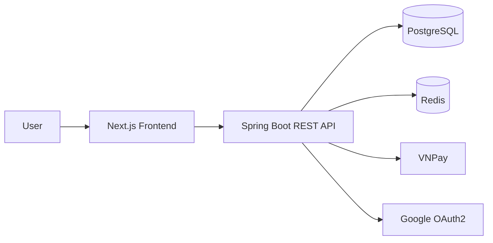

# UTE Fashion Hub

Hệ thống thương mại điện tử chuyên kinh doanh thời trang, được xây dựng theo mô hình Frontend – Backend – Database/Cache. Dự án tập trung vào các chức năng mua sắm trực tuyến, quản lý sản phẩm, giỏ hàng, khuyến mãi, đặt hàng, thanh toán và quản trị.

## 1. Giới thiệu dự án

**Tên dự án:** UTE Fashion Hub  
**Chủ đề:** Xây dựng hệ thống thương mại điện tử kinh doanh thời trang  
**Quy mô nhóm:** 5 thành viên

Hệ thống phục vụ hai nhóm người dùng chính:

- **Khách hàng:** đăng ký/đăng nhập, quản lý hồ sơ và địa chỉ, xem và tìm kiếm sản phẩm, so sánh sản phẩm, quản lý giỏ hàng, sử dụng voucher, đặt hàng và thanh toán.
- **Quản trị viên:** quản lý sản phẩm, danh mục, thương hiệu, đơn hàng và theo dõi doanh thu/thống kê.

---

## 2. Chức năng chính

### M01 – Auth & User Profile

- Đăng nhập và đăng ký tài khoản.
- Quên mật khẩu bằng OTP.
- Đăng nhập bằng Google OAuth2.
- Quản lý hồ sơ cá nhân.
- Quản lý sổ địa chỉ.
- Quản lý địa chỉ 3 cấp: Tỉnh/Thành phố → Quận/Huyện → Phường/Xã.
- Xác thực bằng JWT Access/Refresh Token.
- Phân quyền người dùng và quản trị viên.

### M02 – Admin Catalog

- CRUD sản phẩm.
- Quản lý tồn kho.
- Upload ảnh sản phẩm.
- Soft delete sản phẩm.
- Quản lý thuộc tính JSON Metadata.
- Quản lý danh mục.
- Quản lý thương hiệu.
- Kiểm tra trùng SKU/Slug.
- Các API quản trị yêu cầu quyền Admin.

### M03 – Product Discovery & Comparison

- Trang chủ với Banner, sản phẩm bán chạy, Flash Sale và sản phẩm mới.
- Tìm kiếm sản phẩm.
- Lọc theo nhiều tiêu chí như giá, chất liệu, phong cách và kích thước.
- Xem chi tiết sản phẩm.
- So sánh 2–4 sản phẩm.
- Tính lượt bán `soldCount` từ dữ liệu đơn hàng.

### M04 – Cart & Promotion

- Giỏ hàng cho khách chưa đăng nhập và thành viên.
- Lưu trữ giỏ hàng bằng Redis.
- Đồng bộ giỏ hàng khi đăng nhập.
- Thêm/xóa/cập nhật số lượng sản phẩm.
- Áp dụng voucher.
- Tính giảm giá theo phần trăm hoặc số tiền cố định.
- Kiểm tra điều kiện đơn hàng tối thiểu và lượt sử dụng voucher.

### M05 – Checkout, Payment & Admin Dashboard

- Checkout và đặt hàng.
- Thanh toán COD.
- Thanh toán VNPay.
- VNPay Checkout và IPN/Callback.
- Tra cứu đơn hàng công khai bằng mã đơn hàng/QR.
- Quản lý vòng đời đơn hàng phía Admin.
- Hoàn tồn kho khi đơn hàng bị hủy.
- Lưu lịch sử thay đổi trạng thái đơn hàng.
- Dashboard doanh thu và thống kê đơn hàng.

---

## 3. Công nghệ sử dụng

| Thành phần | Công nghệ | Vai trò |
|---|---|---|
| Frontend | Next.js 16.0.7 | Xây dựng giao diện và routing |
| UI | React 19 | Xây dựng component |
| Ngôn ngữ FE | TypeScript 5 | Kiểm soát kiểu dữ liệu |
| Styling | Tailwind CSS 4 | Xây dựng giao diện |
| State | Zustand | Quản lý state phía client |
| Data Fetching | Axios, SWR | Gọi API và quản lý dữ liệu |
| Icons | Lucide React | Icon giao diện |
| Backend | Java 17 | Ngôn ngữ backend |
| Framework | Spring Boot 3.5.8 | Xây dựng REST API |
| Security | Spring Security 6 | Authentication và Authorization |
| Authentication | JWT, Google OAuth2 | Xác thực người dùng |
| ORM | Spring Data JPA / Hibernate | Làm việc với database |
| Build | Maven Wrapper | Build và chạy backend |
| Database | PostgreSQL 15/16 | Lưu trữ dữ liệu |
| Cache | Redis 7 | Cache và lưu trữ giỏ hàng |
| Container | Docker | Môi trường chạy dịch vụ |

---

## 4. Kiến trúc hệ thống



### Frontend

Ứng dụng web được xây dựng bằng Next.js App Router. Frontend chịu trách nhiệm hiển thị giao diện, quản lý state phía client, gọi REST API và xử lý trải nghiệm người dùng.

### Backend

Spring Boot cung cấp REST API, business logic, authentication/authorization, xử lý đơn hàng, thanh toán và giao tiếp với PostgreSQL/Redis.

### PostgreSQL

Lưu trữ dữ liệu chính của hệ thống như người dùng, sản phẩm, danh mục, giỏ hàng, đơn hàng, thanh toán và lịch sử trạng thái.

### Redis

Được sử dụng cho cache và lưu trữ/xử lý giỏ hàng.

---

## 5. Cấu trúc thư mục

```text
project-root/
├── backend/
│   ├── src/main/java/com/utephonehub/backend/
│   │   ├── config/
│   │   ├── controller/
│   │   ├── dto/
│   │   ├── entity/
│   │   ├── enums/
│   │   ├── exception/
│   │   ├── repository/
│   │   ├── security/
│   │   └── service/
│   ├── src/main/resources/
│   │   ├── application.yml
│   │   └── db/migration/
│   ├── migrations/
│   ├── Dockerfile
│   └── docker-compose.yml
│
├── frontend/
│   ├── app/
│   │   ├── (admin)/
│   │   ├── (auth)/
│   │   ├── (main)/
│   │   ├── admin-panel/
│   │   ├── auth/
│   │   ├── globals.css
│   │   └── layout.tsx
│   ├── components/
│   │   ├── common/
│   │   ├── dashboard/
│   │   ├── features/
│   │   └── ui/
│   ├── hooks/
│   ├── lib/
│   ├── services/
│   ├── store/
│   └── types/
│
├── docs/
└── README.md
```

### Ý nghĩa các thư mục chính

| Folder/File | Ý nghĩa |
|---|---|
| `frontend/app/` | Các route, page và layout của frontend |
| `frontend/components/` | Các component giao diện |
| `frontend/components/features/` | Component theo từng nghiệp vụ |
| `frontend/hooks/` | Custom React hooks |
| `frontend/lib/` | API client, utility và authentication context |
| `frontend/services/` | Các service gọi API |
| `frontend/store/` | State management phía client |
| `frontend/types/` | TypeScript types |
| `backend/.../controller/` | Xử lý HTTP request |
| `backend/.../service/` | Business logic |
| `backend/.../repository/` | Truy cập database |
| `backend/.../entity/` | Entity ánh xạ database |
| `backend/.../dto/` | Data Transfer Object |
| `backend/.../security/` | JWT và security components |
| `backend/.../config/` | Cấu hình hệ thống |
| `backend/src/main/resources/` | Configuration và migration |
| `docs/` | Tài liệu dự án |

---

## 6. Phân công nhóm

| Thành viên | Module | Phạm vi |
|---|---|---|
| Lâm Ngọc Yến Vy | M01 | Auth, Profile, Address, JWT, OAuth2, Shared Files, Security |
| Tô Thuỷ Tiên | M02 | Admin Catalog, Product, Category, Brand, Stock |
| Nguyễn Minh Thư | M03 | Product Discovery, Search, Filter, Detail, Compare |
| Trần Thị Quế Trân | M04 | Cart, Redis Cart, Promotion/Voucher |
| Phạm Thị Thảo Ngân | M05 | Checkout, Order, VNPay, Admin Order, Dashboard |
