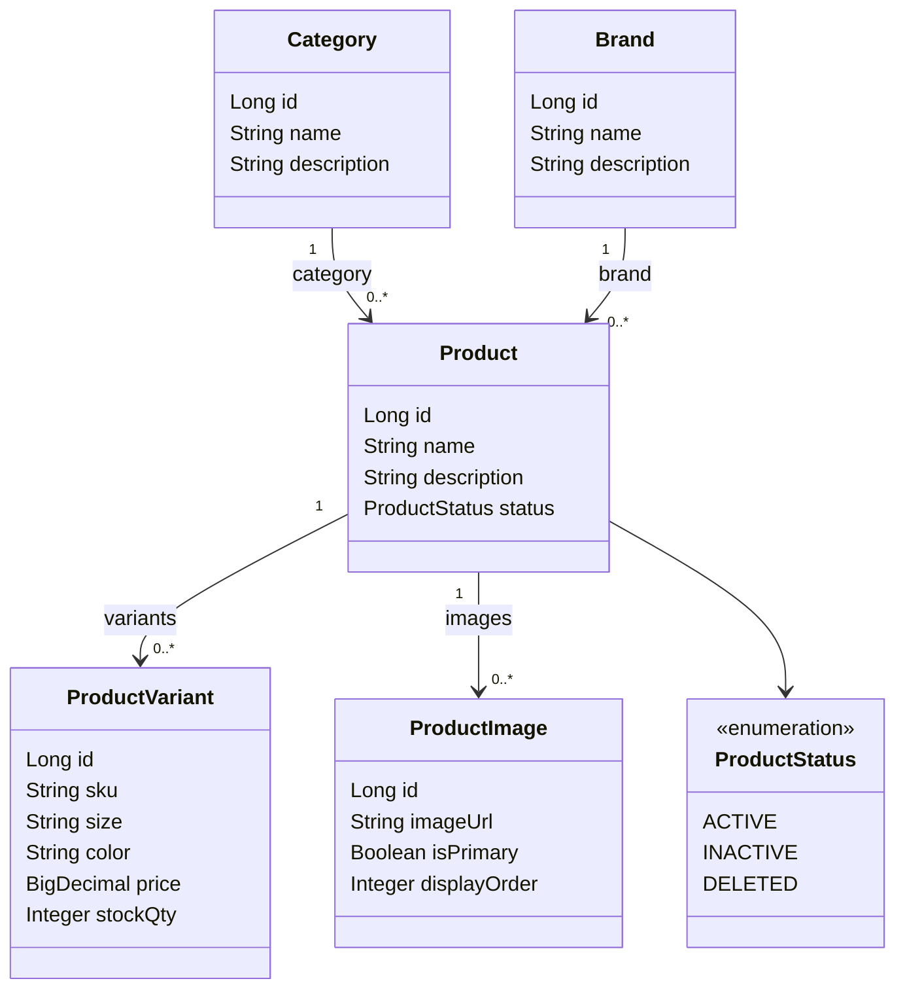

# MODULE CATALOG — HỆ THỐNG BÁN QUẦN ÁO

**Người phụ trách:** Member 2  
**Phạm vi:** Category, Brand, Product, ProductVariant, ProductImage  
**Căn cứ:** bài mẫu UTE Phone Hub (SRS + use case quản lý sản phẩm) và bảng API đã chốt trong tài liệu nhóm.

Tài liệu này chỉ mô tả phần Catalog. Giỏ hàng, đặt hàng, voucher, review và trang mua sắm phía khách thuộc member khác. Catalog cung cấp API sản phẩm để Member 3 hiển thị danh sách, bộ lọc và trang chi tiết. Member 3 không viết controller thứ hai cho `/api/products`, danh mục hoặc bộ lọc.

---

## 1. Phạm vi

### 1.1. Việc Member 2 làm

| Hạng mục | Nội dung |
| :--- | :--- |
| Module chính | M2: Category, Brand, Product, ProductVariant, ProductImage |
| Module phụ | API lọc/tìm sản phẩm để Member 3 gắn vào trang khách |
| Backend | CRUD danh mục và thương hiệu (FR-ADM-01); CRUD sản phẩm và biến thể (FR-ADM-02 → FR-ADM-04); upload ảnh |
| Frontend | Trang Admin: danh mục, thương hiệu, sản phẩm (thêm biến thể, upload ảnh) |
| Database | `categories`, `brands`, `products`, `product_variants`, `product_images` |
| Kiểm thử | SKU trùng (BR-PROD-01); xóa danh mục/thương hiệu khi còn sản phẩm (BR-PROD-02) |
| Tài liệu | Class Diagram miền Product; phần SRS module Catalog |

### 1.2. Việc nằm ngoài Catalog

*   Trang Home, danh sách, chi tiết và form đánh giá phía khách: Member 3.
*   Giỏ hàng, checkout, trừ kho khi đặt hàng, hoàn kho khi hủy đơn: Member 4. Catalog chỉ lưu `stockQty` và từ chối dữ liệu tồn kho âm.
*   Duyệt review, voucher, dashboard: Member 5.
*   `SecurityConfiguration` và file cấu hình gốc: Member 1. Catalog gửi danh sách endpoint, không tự sửa file chung.

### 1.3. Khác bài mẫu điện thoại ở điểm nào

Bài mẫu Phone Hub dùng biến thể dung lượng/màu máy, thông số JSON (màn hình, RAM, pin) và có hướng upload ảnh lên kho ngoài. Đồ án quần áo giữ cùng cách viết SRS, nhưng nghiệp vụ đổi như sau:

*   Một sản phẩm là một mẫu áo/quần/váy. Biến thể là **size + màu**.
*   Giá và tồn kho nằm trên biến thể. Sản phẩm trả `minPrice` = giá thấp nhất trong các biến thể đang bán.
*   Ảnh upload **local**, database chỉ lưu URL/đường dẫn. Chưa dùng dịch vụ lưu trữ ngoài.
*   Trạng thái sản phẩm dùng `ACTIVE`, `INACTIVE`, `DELETED`.

---

## 2. Yêu cầu chức năng

### 2.1. API công khai — Guest xem catalog

| ID | Tên | Mô tả |
| :--- | :--- | :--- |
| **FR-CAT-01** | Xem danh mục và thương hiệu | Guest lấy danh mục và thương hiệu đang dùng để dựng bộ lọc. |
| **FR-CAT-02** | Xem danh sách, tìm kiếm, lọc | Guest xem sản phẩm `ACTIVE`, có phân trang. Lọc theo từ khóa, danh mục, thương hiệu, khoảng giá. |
| **FR-CAT-03** | Xem chi tiết sản phẩm | Trả sản phẩm kèm danh mục, thương hiệu, giá thấp nhất, biến thể và ảnh. |
| **FR-CAT-04** | Sản phẩm liên quan | Trả sản phẩm `ACTIVE` cùng danh mục, loại trừ chính sản phẩm đang xem. |

### 2.2. API quản trị — Admin

| ID | Tên | Mô tả |
| :--- | :--- | :--- |
| **FR-ADM-01** | Quản lý danh mục và thương hiệu | Thêm, sửa, xóa danh mục và thương hiệu. Xóa bị từ chối nếu còn sản phẩm liên kết (BR-PROD-02). |
| **FR-ADM-02** | Thêm sản phẩm | Tạo sản phẩm: tên, mô tả, danh mục, thương hiệu, trạng thái. |
| **FR-ADM-03** | Thêm và sửa biến thể | Mỗi biến thể có SKU, size, màu, giá, `stockQty`. SKU không được trùng (BR-PROD-01). |
| **FR-ADM-04** | Cập nhật, ẩn và xóa mềm sản phẩm | Sửa thông tin sản phẩm. Chuyển `INACTIVE` để ẩn khỏi trang khách. Chuyển `DELETED` để xóa mềm, vẫn giữ dòng dữ liệu cho đơn hàng cũ. |
| **FR-ADM-05** | Upload ảnh sản phẩm | Admin tải ảnh lên thư mục local. Hệ thống lưu đường dẫn vào `product_images`. |

---

## 3. Quy tắc nghiệp vụ

| Mã | Tên | Mô tả |
| :--- | :--- | :--- |
| **BR-PROD-01** | SKU duy nhất | `sku` của biến thể là duy nhất trong toàn hệ thống, không phân biệt hoa thường. Ví dụ `AO-DEN-M` và `ao-den-m` là một SKU. |
| **BR-PROD-02** | Xóa danh mục / thương hiệu | Không xóa Category hoặc Brand khi còn sản phẩm trỏ tới nó, kể cả sản phẩm `INACTIVE` hoặc `DELETED`. Admin chuyển sản phẩm sang danh mục/thương hiệu khác trước, rồi mới xóa. |
| **BR-PROD-03** | Trạng thái hiển thị | Trang công khai chỉ trả sản phẩm `ACTIVE`. `INACTIVE` và `DELETED` chỉ hiện trong API Admin. |
| **BR-PROD-04** | Giá và tồn kho | `price` và `stockQty` thuộc biến thể. `price` > 0. `stockQty` ≥ 0. `minPrice` của sản phẩm là giá nhỏ nhất trong các biến thể của sản phẩm đó. |
| **BR-PROD-05** | Cặp size–màu | Trong một sản phẩm, cặp `(size, color)` không được lặp. Hai mẫu khác nhau vẫn được dùng cùng size và màu. |
| **BR-PROD-06** | Ảnh | Chỉ nhận JPG, JPEG, PNG, WEBP. Mỗi file tối đa 5MB. Mỗi sản phẩm tối đa 8 ảnh. Ảnh đầu tiên là ảnh chính nếu Admin chưa chọn ảnh khác. |
| **BR-PROD-07** | Xóa biến thể đã nằm trong đơn | Nếu biến thể đã có trong chi tiết đơn hàng, API từ chối xóa. Admin đưa `stockQty` về 0 hoặc ẩn sản phẩm. Quy tắc này cần bảng đơn của Member 4; trước khi module đơn có dữ liệu, xóa biến thể chưa bị tham chiếu vẫn được phép. |

Catalog **không** trừ kho khi khách bấm mua. Member 4 trừ `stockQty` trong cùng transaction với checkout, và hoàn kho khi hủy đơn hợp lệ.

---

## 4. Dữ liệu đề xuất chốt trước khi code

Các mục dưới đây là đề xuất của Catalog để người điều phối migration đưa vào schema chung. Cả nhóm dùng một bộ migration, không tạo schema song song.

| Hạng mục | Đề xuất Catalog |
| :--- | :--- |
| Kiểu ID | `BIGINT`, tự tăng. Trên Java là `Long`. |
| Kiểu tiền | `NUMERIC(15,0)`, đơn vị VND, không có phần thập phân. Trên Java là `BigDecimal`. |
| Tồn kho | `INTEGER`, tên trường JSON là `stockQty`. |
| Trạng thái sản phẩm | `ACTIVE`, `INACTIVE`, `DELETED`. |
| Size | Chuỗi tối đa 20 ký tự. Gợi ý: `XS`, `S`, `M`, `L`, `XL`, `XXL`, `FREESIZE`, hoặc số quần `29`, `30`, `31`. |
| Màu | Chuỗi tối đa 50 ký tự. Ví dụ: `Đen`, `Trắng`, `Xanh navy`. |
| Thời gian | `TIMESTAMP`, có `created_at`, `updated_at`. |

### 4.1. Bảng

**categories**

| Cột | Kiểu | Ràng buộc |
| :--- | :--- | :--- |
| id | BIGINT | PK |
| name | VARCHAR(100) | NOT NULL |
| description | TEXT | |
| created_at, updated_at | TIMESTAMP | NOT NULL |

**brands**

| Cột | Kiểu | Ràng buộc |
| :--- | :--- | :--- |
| id | BIGINT | PK |
| name | VARCHAR(100) | NOT NULL |
| description | TEXT | |
| created_at, updated_at | TIMESTAMP | NOT NULL |

**products**

| Cột | Kiểu | Ràng buộc |
| :--- | :--- | :--- |
| id | BIGINT | PK |
| name | VARCHAR(200) | NOT NULL |
| description | TEXT | |
| status | VARCHAR(20) | NOT NULL, mặc định `ACTIVE` |
| category_id | BIGINT | FK → categories.id, NOT NULL |
| brand_id | BIGINT | FK → brands.id, NOT NULL |
| created_at, updated_at | TIMESTAMP | NOT NULL |

**product_variants**

| Cột | Kiểu | Ràng buộc |
| :--- | :--- | :--- |
| id | BIGINT | PK |
| product_id | BIGINT | FK → products.id, NOT NULL |
| sku | VARCHAR(50) | NOT NULL, UNIQUE |
| size | VARCHAR(20) | NOT NULL |
| color | VARCHAR(50) | NOT NULL |
| price | NUMERIC(15,0) | NOT NULL, > 0 |
| stock_qty | INTEGER | NOT NULL, ≥ 0 |
| created_at, updated_at | TIMESTAMP | NOT NULL |

Unique `(product_id, size, color)`.

**product_images**

| Cột | Kiểu | Ràng buộc |
| :--- | :--- | :--- |
| id | BIGINT | PK |
| product_id | BIGINT | FK → products.id, NOT NULL |
| image_url | VARCHAR(500) | NOT NULL |
| is_primary | BOOLEAN | NOT NULL, mặc định false |
| display_order | INTEGER | NOT NULL, mặc định 0 |
| created_at | TIMESTAMP | NOT NULL |

### 4.2. Dữ liệu mẫu gợi ý

Catalog thống nhất nội dung seed với Member 3. Chỉ giữ **một** nguồn seed chính thức. File seed không chạy song song với migration của Member 3.

| Danh mục | Thương hiệu | Sản phẩm | Biến thể minh họa |
| :--- | :--- | :--- | :--- |
| Áo | LocalTee | Áo thun cổ tròn | Đen/M, Đen/L, Trắng/M |
| Quần | DenimDaily | Quần jean ống rộng | Xanh/29, Xanh/30, Đen/30 |
| Váy | LinenHouse | Váy midi linen | Be/S, Be/M |

Ví dụ SKU: `ATS-DEN-M`, `ATS-DEN-L`, `ATS-TRANG-M`.

---

## 5. Class Diagram — miền Product

Vẽ lại bằng diagrams.net. Sơ đồ dưới đây là bản để dựng hình.



Quan hệ:

*   Một danh mục có nhiều sản phẩm. Một sản phẩm thuộc một danh mục.
*   Một thương hiệu có nhiều sản phẩm. Một sản phẩm thuộc một thương hiệu.
*   Một sản phẩm có nhiều biến thể. Mỗi biến thể là một cặp size và màu, có SKU, giá và tồn kho riêng.
*   Một sản phẩm có nhiều ảnh. Đúng một ảnh `isPrimary = true` khi sản phẩm đã có ảnh.

`minPrice` không lưu cột riêng. Service tính từ `price` nhỏ nhất của các biến thể khi tạo response.

---

## 6. Quy ước API dùng chung

Catalog tuân quy ước cả nhóm, không đặt format riêng.

### 6.1. JSON và mã HTTP

| Tình huống | Mã |
| :--- | :--- |
| Đọc thành công | 200 |
| Tạo mới thành công | 201 |
| Xóa thành công, không cần body | 204 |
| Body sai hoặc thiếu trường | 400 |
| Chưa đăng nhập khi gọi API Admin | 401 |
| Đã đăng nhập nhưng không phải Admin | 403 |
| Không tìm thấy id | 404 |
| SKU trùng, cặp size–màu trùng, hoặc xóa danh mục/thương hiệu còn sản phẩm | 409 |

### 6.2. Lỗi

```json
{
  "message": "Dữ liệu không hợp lệ",
  "errors": {
    "sku": "SKU đã tồn tại",
    "price": "Giá phải lớn hơn 0"
  }
}
```

`errors` chỉ có khi lỗi validation hoặc lỗi từng trường. Lỗi nghiệp vụ một câu vẫn có `message`. Ví dụ xóa danh mục còn sản phẩm:

```json
{
  "message": "Không thể xóa danh mục vì vẫn còn sản phẩm liên kết"
}
```

### 6.3. Phân trang

`page` bắt đầu từ 0. `size` mặc định 12 với API công khai, tối đa 50.

```json
{
  "content": [],
  "page": 0,
  "size": 12,
  "totalElements": 0,
  "totalPages": 0
}
```

`sort` chỉ nhận các giá trị: `newest`, `priceAsc`, `priceDesc`, `nameAsc`. Giá trị khác trả 400. Mặc định `newest`.

### 6.4. Quyền

| Nhóm API | Quyền |
| :--- | :--- |
| `GET /api/categories`, `GET /api/brands`, `GET /api/products`, `GET /api/products/{id}`, `GET /api/products/{id}/related` | Công khai, Guest gọi được |
| `/api/admin/**` | Admin. Kiểm tra role Admin, không chỉ kiểm tra “đã đăng nhập” |

Frontend Admin gửi `Authorization: Bearer <accessToken>`. Token nằm ở `localStorage` với key `accessToken`. Catalog không lưu mật khẩu.

### 6.5. Sản phẩm trả về

Tối thiểu các trường: `id`, `name`, `description`, `status`, `category`, `brand`, `minPrice`, `variants`, `images`.

```json
{
  "id": 1,
  "name": "Áo thun cổ tròn",
  "description": "Cotton, form regular.",
  "status": "ACTIVE",
  "category": { "id": 1, "name": "Áo" },
  "brand": { "id": 1, "name": "LocalTee" },
  "minPrice": 199000,
  "variants": [
    {
      "id": 10,
      "sku": "ATS-DEN-M",
      "size": "M",
      "color": "Đen",
      "price": 199000,
      "stockQty": 20
    }
  ],
  "images": [
    {
      "id": 3,
      "url": "/uploads/products/1/ao-den.jpg",
      "isPrimary": true,
      "displayOrder": 0
    }
  ]
}
```

Danh sách công khai vẫn trả đủ các trường trên để Member 3 vẽ card và bộ lọc size/màu từ `variants`, không cần API lọc riêng theo size.

---

## 7. Đặc tả endpoint

### 7.1. Công khai

| Method | Endpoint | Quyền | Mục đích |
| :--- | :--- | :--- | :--- |
| GET | `/api/categories` | Công khai | Danh mục đang dùng |
| GET | `/api/brands` | Công khai | Thương hiệu đang dùng |
| GET | `/api/products` | Công khai | Danh sách, tìm kiếm, lọc |
| GET | `/api/products/{id}` | Công khai | Chi tiết. Sản phẩm không `ACTIVE` thì 404 |
| GET | `/api/products/{id}/related` | Công khai | Tối đa 8 sản phẩm `ACTIVE` cùng `categoryId`, bỏ qua `{id}` |

`GET /api/products` nhận query:

`keyword`, `categoryId`, `brandId`, `minPrice`, `maxPrice`, `page`, `size`, `sort`

Ví dụ: `/api/products?keyword=ao&categoryId=1&page=0&size=12`

*   `keyword` tìm theo tên sản phẩm, không phân biệt hoa thường.
*   Các điều kiện lọc kết hợp theo AND.
*   `minPrice` và `maxPrice` so với `minPrice` của sản phẩm.
*   Thiếu kết quả thì `content` là mảng rỗng, HTTP 200.

### 7.2. Admin — danh mục và thương hiệu (FR-ADM-01)

| Method | Endpoint | Mục đích |
| :--- | :--- | :--- |
| GET | `/api/admin/categories` | Danh sách danh mục |
| POST | `/api/admin/categories` | Tạo danh mục |
| PUT | `/api/admin/categories/{id}` | Sửa danh mục |
| DELETE | `/api/admin/categories/{id}` | Xóa khi không còn sản phẩm |
| GET | `/api/admin/brands` | Danh sách thương hiệu |
| POST | `/api/admin/brands` | Tạo thương hiệu |
| PUT | `/api/admin/brands/{id}` | Sửa thương hiệu |
| DELETE | `/api/admin/brands/{id}` | Xóa khi không còn sản phẩm |

Body tạo/sửa:

```json
{ "name": "Áo", "description": "Áo thun, sơ mi, khoác" }
```

`name` bắt buộc, 2–100 ký tự.

### 7.3. Admin — sản phẩm và biến thể (FR-ADM-02 → FR-ADM-04)

| Method | Endpoint | Mục đích |
| :--- | :--- | :--- |
| GET | `/api/admin/products` | Danh sách, lọc thêm `status` |
| POST | `/api/admin/products` | Tạo sản phẩm |
| GET | `/api/admin/products/{id}` | Chi tiết, gồm cả sản phẩm đã ẩn hoặc xóa mềm |
| PUT | `/api/admin/products/{id}` | Sửa tên, mô tả, danh mục, thương hiệu, trạng thái |
| DELETE | `/api/admin/products/{id}` | Xóa mềm: `status = DELETED` |
| POST | `/api/admin/products/{id}/variants` | Thêm biến thể |
| PUT | `/api/admin/variants/{id}` | Sửa biến thể |
| DELETE | `/api/admin/variants/{id}` | Xóa biến thể nếu chưa nằm trong đơn |

Body tạo sản phẩm:

```json
{
  "name": "Áo thun cổ tròn",
  "description": "Cotton, form regular.",
  "categoryId": 1,
  "brandId": 1,
  "status": "ACTIVE"
}
```

Body biến thể:

```json
{
  "sku": "ATS-DEN-M",
  "size": "M",
  "color": "Đen",
  "price": 199000,
  "stockQty": 20
}
```

Ràng buộc trường:

| Trường | Quy tắc |
| :--- | :--- |
| name | 2–200 ký tự |
| categoryId, brandId | phải tồn tại |
| status | `ACTIVE`, `INACTIVE` hoặc `DELETED` |
| sku | 3–50 ký tự, chữ, số và dấu gạch ngang; duy nhất |
| size | 1–20 ký tự |
| color | 1–50 ký tự |
| price | số nguyên VND, lớn hơn 0 |
| stockQty | số nguyên ≥ 0 |

### 7.4. Admin — ảnh (FR-ADM-05)

| Method | Endpoint | Mục đích |
| :--- | :--- | :--- |
| POST | `/api/admin/products/{id}/images` | Tải một ảnh. `multipart/form-data`, field `file` |
| DELETE | `/api/admin/products/{id}/images/{imageId}` | Xóa ảnh và file local tương ứng |

Response sau khi tải:

```json
{
  "id": 3,
  "url": "/uploads/products/1/ao-den.jpg",
  "isPrimary": true,
  "displayOrder": 0
}
```

File lưu dưới thư mục upload của backend, ví dụ `uploads/products/{productId}/`. Cột `image_url` lưu đường dẫn để frontend ghép với host backend. Không lưu file nhị phân trong PostgreSQL.

---

## 8. Đặc tả use case

### UC-CAT-01. Xem, tìm và lọc sản phẩm

| Mục | Nội dung |
| :--- | :--- |
| Actor | Guest, Customer. Member 3 gọi API này từ trang danh sách. |
| Trigger | Người dùng mở trang sản phẩm hoặc đổi bộ lọc. |
| Pre-Conditions | Có dữ liệu catalog. Người dùng không cần đăng nhập. |
| Post-Conditions | Danh sách `ACTIVE` được trả về theo trang. |
| Main Flow | 1. Client gọi `GET /api/products` kèm query đã chốt. 2. Service chỉ lấy sản phẩm `ACTIVE`. 3. Lọc theo keyword, categoryId, brandId, khoảng giá. 4. Sắp xếp theo `sort`. 5. Trả trang kết quả kèm `minPrice`, `variants`, `images`. |
| Alternate Flow | Không có sản phẩm hoặc bộ lọc rỗng: HTTP 200, `content` rỗng. |
| Exception | `sort` lạ, `page` < 0, `minPrice` > `maxPrice`: HTTP 400, `message` nêu rõ tham số sai. |

### UC-CAT-02. Xem chi tiết và sản phẩm liên quan

| Mục | Nội dung |
| :--- | :--- |
| Actor | Guest, Customer |
| Trigger | Người dùng mở một sản phẩm. |
| Main Flow | 1. `GET /api/products/{id}`. 2. Nếu `ACTIVE`, trả đủ biến thể và ảnh. 3. Client gọi `GET /api/products/{id}/related` để lấy sản phẩm cùng danh mục. |
| Exception | Id không tồn tại hoặc sản phẩm không `ACTIVE`: HTTP 404. |

### UC-CAT-03. Quản lý danh mục

| Mục | Nội dung |
| :--- | :--- |
| Actor | Admin |
| Trigger | Admin mở trang Danh mục. |
| Pre-Conditions | Token Admin còn hiệu lực. |
| Main Flow | 1. Xem `GET /api/admin/categories`. 2. Tạo hoặc sửa bằng name và description. 3. Xóa bằng `DELETE /api/admin/categories/{id}`. 4. Service đếm sản phẩm của danh mục. 5. Nếu số lượng bằng 0, xóa và trả 204. |
| Alternate Flow | Còn sản phẩm: HTTP 409, message theo BR-PROD-02. Không xóa sản phẩm theo dây chuyền. |
| Exception | Thiếu token: 401. Role Customer: 403. Tên trống: 400, `errors.name`. |

Use case thương hiệu giống UC-CAT-03, đổi endpoint sang `/api/admin/brands`.

### UC-CAT-04. Thêm sản phẩm và biến thể

| Mục | Nội dung |
| :--- | :--- |
| Actor | Admin |
| Trigger | Admin bấm Thêm sản phẩm. |
| Pre-Conditions | Đã có ít nhất một danh mục và một thương hiệu. |
| Post-Conditions | Có một product và ít nhất một variant nếu Admin hoàn tất form. |
| Main Flow | 1. Admin nhập tên, mô tả, danh mục, thương hiệu, trạng thái. 2. `POST /api/admin/products` trả 201 kèm `id`. 3. Admin thêm từng size/màu bằng `POST /api/admin/products/{id}/variants`. 4. Service kiểm tra SKU và cặp size–màu. 5. Lưu biến thể, trả 201. 6. Admin upload ảnh bằng UC-CAT-06. |
| Alternate Flow | Admin tạo sản phẩm trước, thêm biến thể sau. Sản phẩm chưa có biến thể thì `minPrice` là `null` và trang công khai chưa nên đưa vào lưới bán. Danh sách công khai bỏ qua sản phẩm chưa có biến thể. |
| Exception | SKU trùng: 409, `errors.sku` = "SKU đã tồn tại". Cặp size–màu đã có trong sản phẩm: 409. Danh mục hoặc thương hiệu không tồn tại: 400. Giá ≤ 0 hoặc `stockQty` < 0: 400. |

### UC-CAT-05. Cập nhật và xóa mềm sản phẩm

| Mục | Nội dung |
| :--- | :--- |
| Actor | Admin |
| Trigger | Admin bấm Sửa hoặc Xóa trên bảng sản phẩm. |
| Main Flow | 1. `GET /api/admin/products/{id}` đổ form. 2. `PUT` ghi các trường sản phẩm. 3. `DELETE /api/admin/products/{id}` đặt `status = DELETED`. 4. Lần gọi công khai sau đó không còn thấy sản phẩm. |
| Alternate Flow | Admin chỉ muốn ẩn tạm: `PUT` với `status = INACTIVE`. Khôi phục: `PUT` với `status = ACTIVE`. |
| Exception | Sửa SKU thành giá trị đã có ở biến thể khác: 409. |

Xóa mềm không xóa biến thể và ảnh, để đơn hàng cũ còn tham chiếu được tên và giá tại thời điểm mua. Snapshot giá trên đơn là việc của Member 4.

### UC-CAT-06. Upload ảnh

| Mục | Nội dung |
| :--- | :--- |
| Actor | Admin |
| Trigger | Admin chọn file ở form sản phẩm. |
| Main Flow | 1. Client gửi `POST /api/admin/products/{id}/images` dạng multipart. 2. Service kiểm tra phần mở rộng, MIME và dung lượng. 3. Ghi file vào thư mục local. 4. Lưu `image_url`. 5. Nếu sản phẩm chưa có ảnh chính, ảnh này được đặt `isPrimary = true`. 6. Trả 201. |
| Exception | Không phải JPG/PNG/WEBP hoặc file lớn hơn 5MB: 400. Đã đủ 8 ảnh: 400. Sản phẩm không tồn tại: 404. |

---

## 9. Màn hình Admin

Member 2 làm các trang sau trong `frontend/`. Router gốc do người phụ trách cấu hình ghép, Catalog chỉ đưa page và component.

| Màn hình | Việc trên màn hình | API |
| :--- | :--- | :--- |
| Danh mục | Bảng tên, mô tả; form thêm/sửa; nút xóa | `/api/admin/categories` |
| Thương hiệu | Cùng kiểu với danh mục | `/api/admin/brands` |
| Sản phẩm | Bảng ảnh, tên, danh mục, thương hiệu, `minPrice`, trạng thái; lọc theo status | `GET /api/admin/products` |
| Form sản phẩm | Tên, mô tả, danh mục, thương hiệu, trạng thái; khối biến thể; khối upload ảnh | products, variants, images |

Khi xóa danh mục hoặc thương hiệu bị 409, trang hiện `message` trả về, không đóng form bằng thông báo chung chung.

Form biến thể có các ô SKU, size, màu, giá, tồn kho. Lỗi 409 của SKU hiện ngay dưới ô SKU.

Ô ảnh chỉ cho chọn `.jpg`, `.jpeg`, `.png`, `.webp` và chặn file trên 5MB ngay trên trình duyệt. Backend vẫn kiểm tra lại.

---

## 10. Phần Catalog bàn giao cho Member 3

Member 3 dựng trang Home, danh sách, chi tiết và chỉ gọi API công khai của Catalog.

| Nhu cầu giao diện | Cách lấy dữ liệu |
| :--- | :--- |
| Dropdown danh mục | `GET /api/categories` |
| Dropdown thương hiệu | `GET /api/brands` |
| Ô tìm và khoảng giá | query `keyword`, `minPrice`, `maxPrice` |
| Lưới sản phẩm | `content[]`: tên, `minPrice`, ảnh có `isPrimary = true` |
| Chọn size, màu, tồn kho ở trang chi tiết | `variants[]` của `GET /api/products/{id}` |
| Sản phẩm cùng danh mục | `GET /api/products/{id}/related` |

`variantId` trong từng biến thể là id Member 4 đưa vào giỏ. Catalog không nhận giá từ frontend khi tính tiền.

Bộ lọc đã chốt chưa có query `size` và `color`. Size và màu nằm trong `variants` của từng sản phẩm. Nếu sau này trang danh sách cần lọc đúng size, cả nhóm bổ sung query rồi Catalog mới thêm. Hiện Catalog không tự thêm tham số ngoài bảng đã chốt.

---

## 11. Kiểm thử

Backend dùng JUnit 5 và Spring Boot Test. Chưa dùng công cụ automation cho giao diện. Hai ca bắt buộc của phân công:

| Mã test | Quy tắc | Các bước | Kết quả mong đợi |
| :--- | :--- | :--- | :--- |
| **TC-SKU-01** | BR-PROD-01 | Tạo biến thể SKU `ATS-DEN-M`. Tạo biến thể khác cùng SKU, khác hoa thường `ats-den-m`. | Lần hai trả 409. `errors.sku` có nội dung SKU đã tồn tại. Database vẫn một dòng. |
| **TC-CAT-01** | BR-PROD-02 | Tạo danh mục, tạo sản phẩm thuộc danh mục đó, gọi xóa danh mục. | 409. Danh mục và sản phẩm còn nguyên. |
| **TC-BRAND-01** | BR-PROD-02 | Làm tương tự với thương hiệu đang có sản phẩm. | 409. Thương hiệu còn nguyên. |
| **TC-CAT-02** | BR-PROD-02 | Xóa danh mục không có sản phẩm. | 204. |
| **TC-PUB-01** | BR-PROD-03 | Tạo một sản phẩm `INACTIVE`, gọi `GET /api/products` không gửi token. | 200. Sản phẩm đó không nằm trong `content`. |
| **TC-ADM-01** | Quyền Admin | Gọi `POST /api/admin/categories` bằng token Customer. | 403. |
| **TC-IMG-01** | BR-PROD-06 | Upload file PDF và file PNG lớn hơn 5MB. | Cả hai trả 400. Không tạo dòng `product_images`. |

Ca giao diện làm tay trên trang Admin: thêm áo với hai size, upload một ảnh JPG dưới 5MB, tìm `keyword=ao` trên API public, thử xóa danh mục đang có áo và thấy thông báo 409.

---

## 12. Thứ tự làm

1. Chốt với người điều phối migration năm bảng ở mục 4 và kiểu ID, tiền, trạng thái.
2. Chốt với Member 3 nội dung seed quần áo, một nguồn duy nhất.
3. Viết entity, repository, service, controller đúng endpoint mục 7.
4. Gửi Member 1 danh sách path công khai và path `/api/admin/**` để gắn quyền. Không tự sửa `SecurityConfiguration`.
5. Viết test BR-PROD-01 và BR-PROD-02 trước khi làm giao diện.
6. Làm trang Admin danh mục, thương hiệu, sản phẩm.
7. Nhờ Member 3 gọi thử `GET /api/products?keyword=ao&categoryId=1&page=0&size=12`.

Pull request Catalog vào nhánh tích hợp sau Auth, vì quyền Admin và cách đọc JWT do Member 1 cấu hình. Trong PR chỉ giữ một controller sản phẩm.
