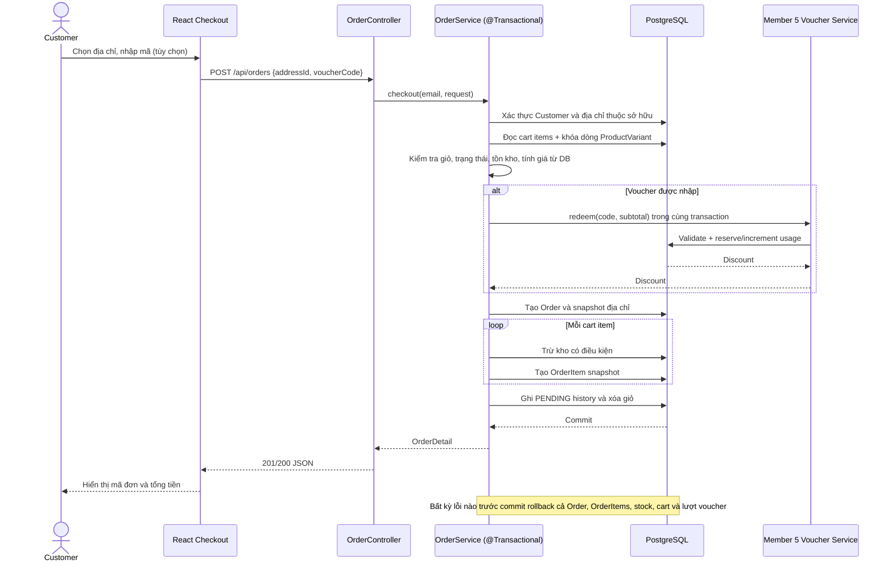

# Sequence Diagram — Checkout COD

```mermaid
sequenceDiagram
    actor Customer
    participant UI as React Checkout
    participant API as OrderController
    participant S as OrderService (@Transactional)
    participant DB as PostgreSQL
    participant V as Member 5 Voucher Service
    Customer->>UI: Chọn địa chỉ, nhập mã (tùy chọn)
    UI->>API: POST /api/orders {addressId, voucherCode}
    API->>S: checkout(email, request)
    S->>DB: Xác thực Customer và địa chỉ thuộc sở hữu
    S->>DB: Đọc cart items + khóa dòng ProductVariant
    S->>S: Kiểm tra giỏ, trạng thái, tồn kho, tính giá từ DB
    alt Voucher được nhập
        S->>V: redeem(code, subtotal) trong cùng transaction
        V->>DB: Validate + reserve/increment usage
        DB-->>V: Discount
        V-->>S: Discount
    end
    S->>DB: Tạo Order và snapshot địa chỉ
    loop Mỗi cart item
        S->>DB: Trừ kho có điều kiện
        S->>DB: Tạo OrderItem snapshot
    end
    S->>DB: Ghi PENDING history và xóa giỏ
    DB-->>S: Commit
    S-->>API: OrderDetail
    API-->>UI: 201/200 JSON
    UI-->>Customer: Hiển thị mã đơn và tổng tiền
    Note over S,DB: Bất kỳ lỗi nào trước commit rollback cả Order, OrderItems, stock, cart và lượt voucher
```
