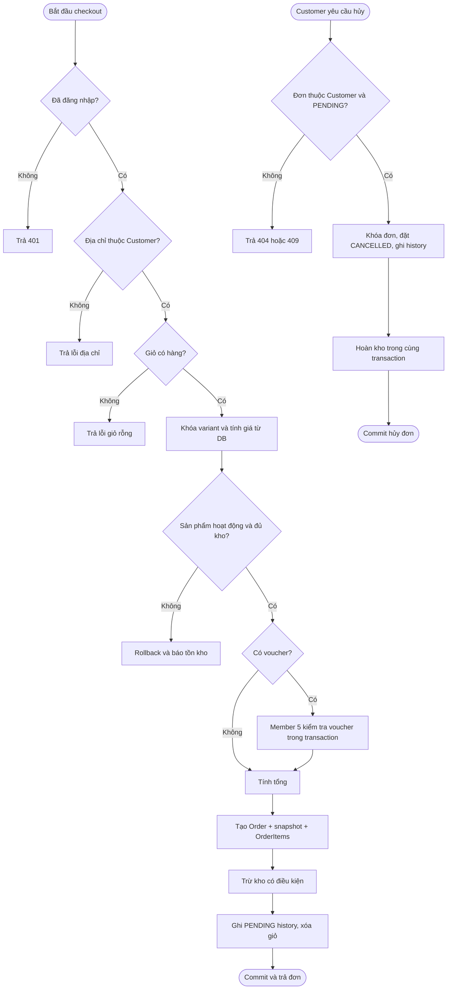

# Activity Diagram — Đặt hàng và hủy đơn

```mermaid
flowchart TD
    A([Bắt đầu checkout]) --> B{Đã đăng nhập?}
    B -- Không --> X[Trả 401]
    B -- Có --> C{Địa chỉ thuộc Customer?}
    C -- Không --> Y[Trả lỗi địa chỉ]
    C -- Có --> D{Giỏ có hàng?}
    D -- Không --> Z[Trả lỗi giỏ rỗng]
    D -- Có --> E[Khóa variant và tính giá từ DB]
    E --> F{Sản phẩm hoạt động và đủ kho?}
    F -- Không --> R[Rollback và báo tồn kho]
    F -- Có --> G{Có voucher?}
    G -- Có --> H[Member 5 kiểm tra voucher trong transaction]
    G -- Không --> I[Tính tổng]
    H --> I
    I --> J[Tạo Order + snapshot + OrderItems]
    J --> K[Trừ kho có điều kiện]
    K --> L[Ghi PENDING history, xóa giỏ]
    L --> M([Commit và trả đơn])
    N([Customer yêu cầu hủy]) --> O{Đơn thuộc Customer và PENDING?}
    O -- Không --> P[Trả 404 hoặc 409]
    O -- Có --> Q[Khóa đơn, đặt CANCELLED, ghi history]
    Q --> S[Hoàn kho trong cùng transaction]
    S --> T([Commit hủy đơn])
```
